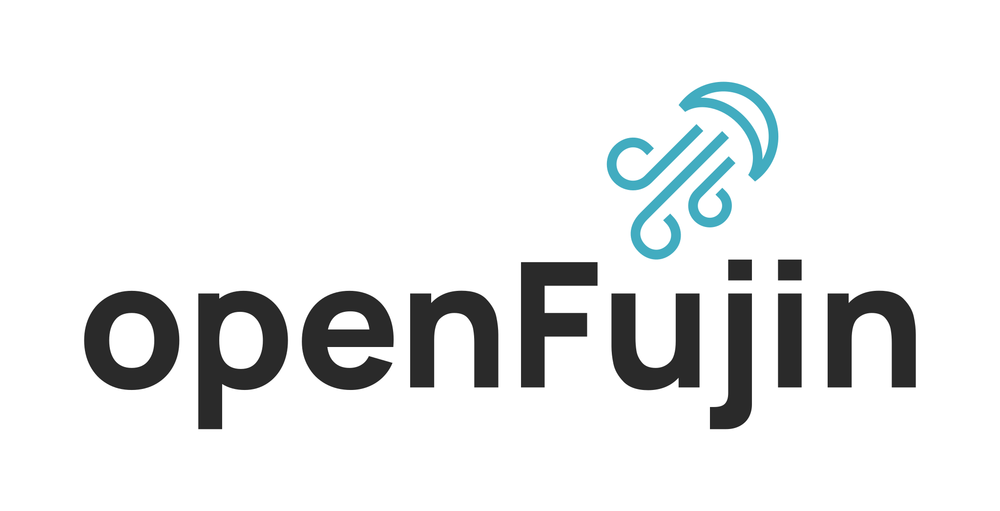

<h1 align="center">
   
  
   
  OpenFujin
   
</h1>

<h4 align="center">An operating environment built on the principles of UNIX, but made in PHP <small>(Seriously)</small></h4>

OpenFujin is an open source fork of Fujin project, respecting its license and copyrights. The OpenFujin project is licensed under the [Apache License 2.0](LICENSE), which permits you to freely use, modify, and share this code with the community.

## License

OpenFujin project is licensed under the [Apache License 2.0](LICENSE). The Apache License 2.0 is an open source license that allows you to use the code freely in accordance with its terms. The Apache License 2.0 provides clear provisions regarding copyrights, patents, and responsibilities.

## Project Name and Logo

We are committed to preserving the name "OpenFujin" and its associated logo. The name and logo are important elements of our project identity. Any derivative projects must respect and retain the name and logo as specified in the Apache License 2.0.

## Coding Style

Please note that our coding style follows a convention that does not use camel case but instead employs underscores. We appreciate your cooperation in maintaining this style when making contributions to OpenFujin.

## How to Contribute

We welcome you to join the OpenFujin community! We have open doors for contributors, and we are excited about your contributions to the project. To contribute, please follow these steps:

1. Fork this repository
2. Create your own branch (`git checkout -b yourbranch`)
3. Make changes and improvements
4. Commit your changes (`git commit -m 'Description of your change'`)
5. Push your branch to GitHub (`git push origin yourbranch`)
6. Send a pull request

It's important to follow the project's contribution guidelines and ensure that your changes are in compliance with the Apache License 2.0.

## Related

- [FujinDomains](https://github.com/mozekvlaku/FujinDomains) - An Active Directory like login system for OpenFujin

## Support

